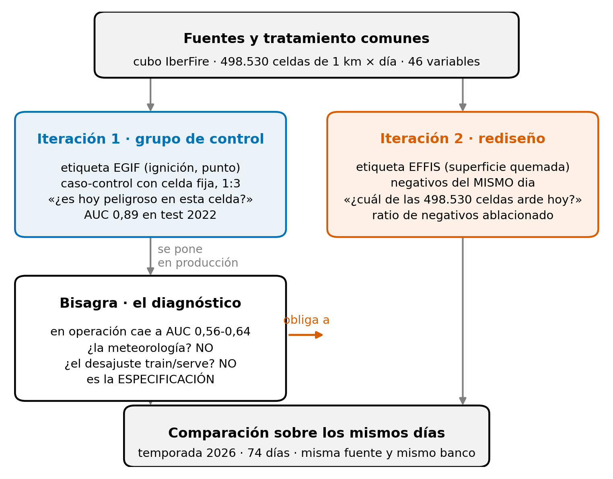

# El marco: un trabajo hecho dos veces

## El hilo

```
                     FUENTES Y TRATAMIENTO  (01_datos, 02_eda)
                     comunes a las dos iteraciones
                                 │
        ┌────────────────────────┴────────────────────────┐
        │                                                 │
  ITERACIÓN 1  (03)                                 ITERACIÓN 2  (05)
  etiqueta EGIF (ignición)                          etiqueta EFFIS (superficie
  negativos: la misma celda otros días              quemada, la misma con la que
  pregunta: ¿es hoy peligroso en esta celda?        se evalúa)
  AUC test 0.89                                     negativos: otras celdas del
        │                                           mismo día
        │  se pone en producción                    pregunta: ¿cuál de las
        │  687 estaciones, mapa diario              498,530 celdas arde hoy?
        ▼                                                    │
  DIAGNÓSTICO  (04)                                          │
  en operación: AUC 0.57-0.64                                │
   41  medido contra tres verdades independientes            │
   42  ¿es la meteorología?  no                              │
   43  ¿es el train/serve?   no                              │
   44  es la especificación: etiqueta y muestreo             │
        └────────────────────────┬────────────────────────┘
                                 ▼
                    COMPARACIÓN  (06)  mismos días, mismas fuentes;
                    replay de 2025 y 2026 = el resultado de la memoria
                                 │
                                 ▼
                    PRODUCCIÓN  (07)  el mapa de cada mañana: r10 en escala absoluta y por percentil, con la cifra del día
```



*El mismo hilo, dibujado: la primera iteración, el diagnóstico y la segunda.*

## Dos decisiones de redacción

La memoria sigue el orden lógico y no el cronológico: el orden en que hay que
leer cada parte para entender la conclusión. Los intentos que se descartaron
por el camino están recogidos en `docs/BITACORA.md` y no en la memoria.

El primer modelo se presenta como grupo de control. Sin él no se podría
comprobar que el rediseño hacía falta ni cuantificar lo que aportó.

La memoria, con sus anexos, está en [`docs/MEMORIA/`](../docs/MEMORIA/README.md).
El glosario está en [`GLOSARIO.md`](GLOSARIO.md).

## Las tres preguntas que separan las dos iteraciones

|  | Iteración 1 | Iteración 2 |
|---|---|---|
| Qué es un positivo | ignición registrada en EGIF (Estadística General de Incendios Forestales) | celda con superficie quemada en EFFIS (*European Forest Fire Information System*) |
| Qué es un negativo | la misma celda en otros días | otras celdas del mismo día |
| Contra qué se evalúa | superficie quemada y partes del MITECO (Ministerio para la Transición Ecológica y el Reto Demográfico) | lo mismo, y ahora coincide con el entrenamiento |

La tercera fila recoge el problema de la iteración 1: la etiqueta de
entrenamiento (una ignición) y la de evaluación (superficie quemada) eran
distintas, y el AUC (*Area Under the ROC Curve*) de desarrollo no lo
detectaba.
