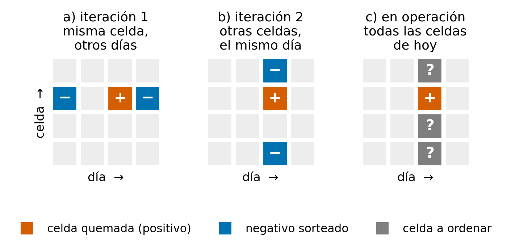
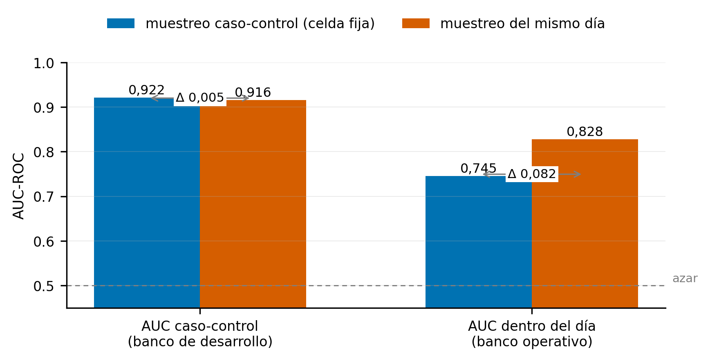

# 4 · El diagnóstico: por qué el 0.89 no medía lo que hacía falta

El modelo daba 0.89 en el conjunto de prueba y entre 0.57 y 0.64 en operación.
Se probaron tres explicaciones, en este orden, y las dos primeras se
descartaron con medidas. La tercera es la que queda en pie.

```
41  ¿Está mal medido?      no: tres verdades independientes dicen lo mismo
42  ¿Es la meteorología?   no: hay diferencias de fuente, pero no bastan
43  ¿Es el train/serve?    no: lo que cambia entre entrenar y servir cuesta 0.0045
44  Es la especificación   la etiqueta y el muestreo definían otra pregunta
```



*(a) Negativos en la misma celda otros días. (b) Negativos en otras celdas del mismo día. (c) Lo que se pide en operación.*

## 41 · La medida en operación

Se compararon cinco puntuaciones contra tres verdades independientes: los
focos FIRMS (*Fire Information for Resource Management System*), los
perímetros de EFFIS (*European Forest Fire Information System*) y los partes
del MITECO (Ministerio para la Transición Ecológica y el Reto Demográfico). La
tabla recoge el AUC (*Area Under the Curve*) del modelo y del percentil local
del FWI (*Fire Weather Index*), con su diferencia y su intervalo de
confianza (IC).

| Serie (20 días) | Modelo | FWI percentil local | Diferencia (IC95) |
|---|---|---|---|
| Previsión del día | 0.642 | 0.702 | −0.060 [−0.149, +0.020] |
| Ranking a día cerrado | 0.707 | 0.668 | +0.039 [−0.047, +0.116] |

Ninguna diferencia es significativa. El modelo en operación no se distinguía
de un índice sin modelo, el percentil local del FWI. Esta medida sirvió para
detectar el problema; la validación del trabajo es el replay de las dos
temporadas siguientes, descrito en el capítulo de comparación.

| Script | Qué hace | Para qué se usa |
|---|---|---|
| `descargar_verdad_operativa.py` | Baja las verdades (EFFIS y FIRMS) de la temporada en curso | Entrada de las validaciones |
| `validar_operativo.py` | Cinco puntuaciones contra tres verdades, con intervalos por remuestreo de días | La tabla de arriba |
| `validar_miteco.py` | Geocodifica los incidentes del parte del MITECO y puntúa las previsiones contra ellos | La tercera verdad |
| `dashboard_miteco_datos.py` | Prepara los datos de un panel de validación contra el MITECO | Visualización |
| `validar_eventos_firms.py` | Validación fuera de tiempo 2021-2024: eventos FIRMS contra el riesgo del modelo con las variables del cubo | Comprobar el modelo antes de servirlo |
| `validar_eventos_estaciones.py` | Lo mismo en 2025-2026 con la tubería de estaciones de producción | Validación en la geometría de servicio |
| `extraer_evento.py` | Extracción evento a evento (punto y ventana temporal) para incendios conocidos | Comprobaciones tempranas |

## 42 · Primera hipótesis: la meteorología

Es el bloque más grande del repositorio porque esta hipótesis era la más
plausible y había que agotarla. Se midió la diferencia entre ERA5-Land y AEMET
(Agencia Estatal de Meteorología) variable a variable. Se probaron el IFS
(*Integrated Forecasting System*), un híbrido y correcciones por cuantiles. En
el camino se construyó la cadena de malla que después fue la base de la
iteración 2.

Tres resultados quedaron firmes. La precipitación no coincide entre fuentes:
+8.00 mm en 30 días, y de ahí sale un FWI 10 puntos más bajo. La climatología
del percentil no debe cruzar fuentes: con numerador de AEMET y referencia del
cubo, la variable satura, con el 12.6 % de las filas en percentil 99.9 o más en
producción frente al 1.0 % en entrenamiento; por eso la malla calcula
numerador y denominador con la misma fuente. Y el cubo es ERA5-Land
reprocesado: temperatura, humedad y viento coinciden con correlación
0.987-0.998 y sesgo cero, y solo difiere la precipitación.

La comparación directa de AUC entre fuentes meteorológicas no se reporta
porque su control no cerró (`docs/LIMITACIONES.md` §2). Lo anterior basta
para descartar la hipótesis.

| Script | Qué hace | Para qué se usa |
|---|---|---|
| `experimento_b_era5.py` | Compara variable a variable la meteorología de producción (AEMET) con ERA5-Land en las mismas estaciones y días | El +8 mm y el −10 de FWI |
| `experimento_b_fase2.py` | Puntúa el modelo con tres fuentes meteorológicas | Medir si el AUC depende de la fuente |
| `diagnostico_fwi.py` | De dónde sale el factor 2 entre el FWI de entrenamiento y el de producción | Diagnóstico |
| `verificar_hora_fwi.py` | Comprueba que el FWI del cubo es el de las 13 UTC | Fijar la hora del FWI en servicio |
| `verificar_fuentes_meteo.py` | Qué fuente predice mejor el tiempo observado (IFS, ERA5, AEMET) | Elegir el IFS para la previsión |
| `construir_clim_fwi_aemet.py` | Climatología de FWI calculada desde AEMET, misma fuente que el numerador | Alternativa medida para la producción por estaciones |
| `malla_02_verificar.py` | Comprueba la agregación de horario a diario de ERA5-Land | Control de calidad de la malla |
| `malla_02_vs_cubo.py` | El cubo frente a ERA5-Land nativo, variable a variable | Decidir entrenar con el cubo |
| `malla_02b_prueba.py`, `_hibrido.py`, `_correccion.py`, `_reajuste.py` | La rama de previsión paso a paso: denominador, híbrido reanálisis+IFS, corrección del viento del IFS y ajuste del mapeo IFS → ERA5-Land con toda la malla | El mapeo que usa la cadena diaria |
| `malla_03_cuantiles.py`, `malla_03b_fwi_qm.py`, `malla_03c_aceptacion.py` | Correcciones por cuantiles de la precipitación y del FWI, con su prueba de aceptación | Medidas y descartadas: llevar el FWI a la escala del cubo empeora |
| `malla_05_riesgo.py`, `malla_05b_evaluacion.py` | Mapa retrospectivo desde la malla sin interpolación y su discriminación en varios días | Comprobar que la malla discrimina como el cubo |
| `prueba_era5_atribucion.py`, `prueba_era5_produccion.py`, `prueba_ifs_produccion.py`, `prueba_hibrido_produccion.py`, `prueba_hibrido_corregido.py` | Cinco pruebas acotadas: de dónde viene el sesgo de ERA5, y si ERA5, el IFS o el híbrido sirven como entrada de producción | El camino hasta la configuración de servicio |
| `prototipo_malla/` | La primera versión de los módulos de malla (`malla_01`, `02`, `04`, `05`, `05b`), la que produjo los números de este capítulo | La versión definitiva de `01_datos/` y `07_produccion/` divergió después, y se conservan las dos |

## 43 · Segunda hipótesis: el desfase entre entrenar y servir

Se auditaron las 46 variables una por una y se midió por ablación lo que
cuestan las aproximaciones que usa producción para las variables que no tiene
en tiempo real. La tabla recoge la pérdida de AUC en el conjunto de prueba.

| Aproximación operativa | Δ AUC en test 2020 |
|---|---|
| Vegetación y LST de satélite sustituidas por su climatología mensual | −0.004 |
| Rayos a cero | −0.000 |
| Las dos, como en producción | −0.0045 |

Esa pérdida no explica la diferencia. Como resultado secundario, las cinco
variables de satélite aportan lo mismo reales que congeladas.

| Script | Qué hace | Para qué se usa |
|---|---|---|
| `auditoria_train_serve.py` | Para cada variable, qué le llega al modelo en producción frente a lo que vio al entrenar, y cuánto cuesta cada desviación | La auditoría |
| `ablacion_proxies_operativos.py` | Reentrena y evalúa con las variables de satélite congeladas y los rayos a cero, con bootstrap por bloques | El −0.0045 |
| `dos_06_deriva.py` | Deriva de distribución (PSI, *Population Stability Index*) entre el cubo y ERA5-Land en los nodos | Comprobar la malla antes de servirla |

## 44 · Tercera hipótesis: la especificación

Dos medidas cambiaron la dirección del trabajo. En la muestra caso-control,
el 98.8 % de las celdas tenía exactamente un 25 % de positivos. El modelo no
podía aprender qué celda es más peligrosa que otra, solo qué día lo es. Y el
AUC caso-control de los dos diseños es el mismo (0.92) mientras que
el AUC dentro del día los separa (0.744 frente a 0.828): la métrica de
desarrollo no veía la diferencia.



*AUC caso-control (igual para los dos diseños) frente a AUC dentro del día (que los separa).*

| Script | Qué hace | Para qué se usa |
|---|---|---|
| `dos_00_cubo_etiquetas.py` | Una pasada por el cubo para medir la etiqueta real: prevalencia por año, persistencia, EGIF frente a EFFIS | Los números de prevalencia del capítulo 2 |
| `dos_02_muestrear.py` | La tabla maestra con los tres diseños de muestreo (misma celda otro día, otra celda mismo día, y evaluación dentro del día) | La comparación de diseños de `05_iteracion2/55_train/dos_05_modelos.py` |

El ajuste no era el problema. El modelo se entrenó para responder «¿es hoy
peligroso en esta celda?», y en operación la pregunta es «¿cuál de las
498,530 celdas arde hoy?».
