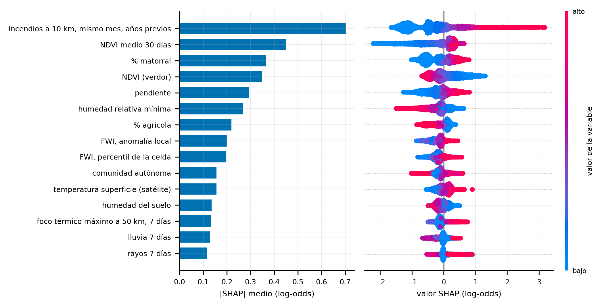
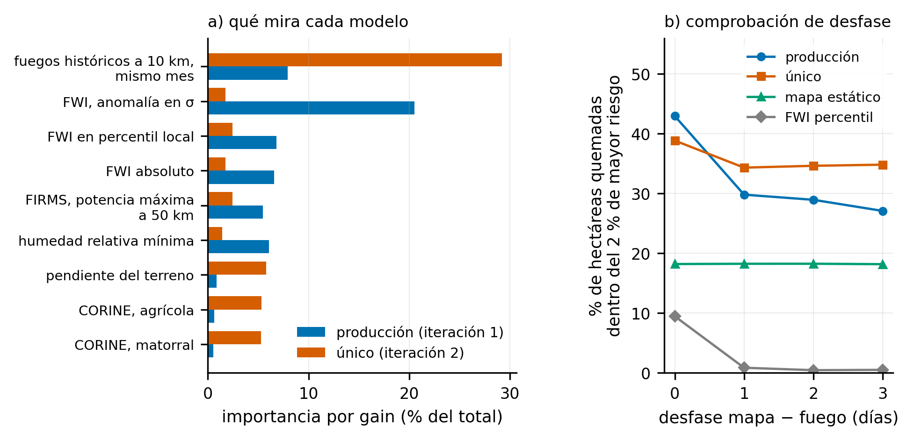

# 5 · Segunda iteración: negativos del mismo día y etiqueta EFFIS

## Qué pregunta responde

«¿Cuál de las 498,530 celdas arde hoy?», la que se hace en operación. El
capítulo consiste en construir un conjunto de entrenamiento que haga esa
pregunta y nada más.

## Los dos cambios

| | Iteración 1 | Iteración 2 |
|---|---|---|
| Negativos | la misma celda, otros días | otras celdas, el mismo día |
| Etiqueta | ignición EGIF | superficie quemada EFFIS (`is_fire` del cubo, celda con al menos 5 ha) |

Las variables son las mismas 46 y los hiperparámetros los mismos, a propósito:
si algo mejora, no se puede atribuir a información nueva ni al ajuste. El split
es temporal: entrenamiento 2015-2022, validación 2023, test 2024. Las
temporadas 2025 y 2026 quedan como prueba externa (`06_comparacion/`).

## Qué hace cada script

| Carpeta / script | Qué hace | Para qué se usa |
|---|---|---|
| `51_celdas/dos_01_celdas.py` | La tabla por celda: censo de las 498,530 con sus estáticas, climatologías e historial | Base del DÓNDE y de todo lo que se evalúa por celda |
| `52_muestreo/dos_12_muestrear_effis.py` | Tabla maestra con etiqueta EFFIS. Positivos: el primer día de cada celda quemada, con un tope de 30 por día y bloque de 100 km. Negativos: otras celdas del mismo día. Además, un banco de evaluación dentro del día (veranos 2023 y 2024) | El dataset de los modelos definitivos |
| `53_features/dos_03_features.py` | Variables del cubo y de historia para la tabla maestra, importando la receta de `extraer_features_cubo.py` (la misma de producción). Todas las ventanas terminan antes del día | `dataset_effis.parquet` |
| `54_analisis/dos_04_analisis.py` | Autocorrelación espacial, coste de la partición aleatoria, susceptibilidad estática, cruce EGIF-EFFIS | Números del capítulo 2 |
| `55_train/dos_05_modelos.py` | Entrena DÓNDE y CUÁNDO con etiqueta EGIF, los combina y los mide dentro del día contra producción. Calcula también el AUC caso-control de cada diseño | La prueba de que la métrica de laboratorio no veía la diferencia (0.92 y 0.92; 0.744 frente a 0.828) |
| `55_train/dos_10_donde_effis.py` | El DÓNDE con etiqueta de superficie quemada | Primer modelo con la etiqueta nueva |
| `55_train/dos_13_modelos_effis.py` | Los modelos definitivos con etiqueta EFFIS (único, dónde, cuándo) y su test en 2024 | `donde_dia_effis` (único 1:3) y la pareja |
| `56_calibracion/` | Del orden a la probabilidad: cortes, aviso de día, escala absoluta y calibración por celda | [README propio](56_calibracion/README.md) |
| `57_ablaciones/dos_18_ratio.py` | Escalera de negativos por positivo (1:3, 1:10, 1:30, 1:60, 1:100) con la misma receta | De aquí sale el r10 |
| `57_ablaciones/dos_08_verano.py` | ¿Entrenar solo con verano mejora el producto de verano? | No: el DÓNDE empeora (−0.028) |
| `57_ablaciones/dos_17_capa_quemado.py` | ¿Ayuda apagar las celdas ya quemadas? | No: entre −0.016 y −0.024 según la ventana |
| `57_ablaciones/dos_24_auditoria_fugas.py` | Para cada variable, comprueba si su valor en el día D lleva información del propio fuego, comparando con un anillo de control | Las variables de satélite del día D pesan un 4 % del r10; en servicio van por climatología |
| `57_ablaciones/dos_30_r10_todo.py` | El r10 reentrenado con 2015-2024, con el protocolo escrito antes de ejecutar | Más años no cambian el orden (`docs/R10_TODOS_LOS_ANIOS.md`) |
| `57_ablaciones/dos_34_auditoria_geometria.py` | El filtro de vecinos es una caja en entrenamiento y un círculo en servicio | Diferencia de escala (1.39×), no de orden (`docs/LIMITACIONES.md` §8) |

*Las 15 variables de mayor peso del r10 sobre 6,000 celdas-día de los veranos de 2023 y 2024.*

*Importancia por ganancia del modelo de producción y del único, y la comprobación de desfase entre entrenamiento y servicio.*

## Los tres modelos que salen de aquí

- El único (`donde_dia_effis`): las 46 variables, negativos del mismo día,
  etiqueta EFFIS. AUC 0.809 en test 2024 y 0.752 sobre la temporada 2026 con
  reanálisis; 0.759 con diez negativos por positivo, que es el r10.
- El dónde (`donde_effis_c`): una fila por celda, sin meteorología. Responde
  «¿esta celda es propensa?» y su mapa es el mismo todos los días.
- El cuándo: solo las variables dinámicas, con negativos de la misma celda en
  otros días. Responde «¿hoy es peligroso?». La pareja es el producto de los
  dos: 0.705 en 2026.

## Las ablaciones

| Pregunta | Respuesta |
|---|---|
| ¿Cuántos negativos por positivo? | El óptimo está entre 1:10 y 1:30; desde 1:60 empeora. Se elige el 1:10 |
| ¿Entrenar solo con verano mejora el producto de verano? | No: el DÓNDE empeora |
| ¿Ayuda una capa de «ya quemado»? | No: −0.02. La etiqueta EFFIS penaliza bajar el riesgo en la cicatriz |
| ¿Reentrenar el r10 con todos los años (hasta 2024)? | +0.003, con IC que cruza el cero. El modelo está saturado de datos |
| ¿Es el filtro de vecinos una caja o un círculo? | Caja al entrenar y círculo al servir: cambia la escala, no el orden |

Sobre el ratio conviene ser prudente. La ganancia en AUC medio (entre +0.006 y
+0.017 según el año) es del orden del ruido del sorteo de negativos (0.004,
medido repitiendo el sorteo con la misma receta). En la temporada 2026 el r10
fue el que mejor situó el fuego grande (percentil ponderado por hectáreas de
79.5 con 1:3 a 81.9 con 1:10), y en el replay de 2025 y 2026 el 1:3 y el 1:10
empatan en AUC. Se elige el r10 y se dice con esa cautela.

## Del orden a la probabilidad

El modelo ordena bien, pero un mapa que pinta de rojo el 2 % superior de cada
día se lee como «estas celdas van a arder», y eso es falso casi todo el año.
Los scripts `dos_25` a `dos_32` pasan los cinco modelos por los diez años del
cubo y sacan tres cosas: un aviso de día (el semáforo) con umbral fijo, que
funciona en invierno y primavera (BSS +0.30) y no en verano (el IC cruza el
cero); una escala fija para el mapa (en EXTREMO arde una celda de cada 800,
36 veces la tasa media); y la medida de que la probabilidad por celda sirve
para ordenar y para dar la magnitud típica, no como valor absoluto por celda y
día. Está todo en el README de `56_calibracion/`. La cadena diaria de
`07_produccion/` publica el mapa con la escala absoluta, recalibrada sobre los
mapas servidos, y la cifra del día. El semáforo se evaluó fuera de calibración
y se descartó (`07_produccion/escala_y_cifra/README.md`).

## Ejecutar

Estos scripts leen el cubo día a día (29 GB) y los datasets del disco externo
(`TFM_USB`). No se pueden ejecutar con `muestras/`, que solo lleva las capas
estáticas. Lo que sí corre con la muestra es la rama de servicio del capítulo 7.
