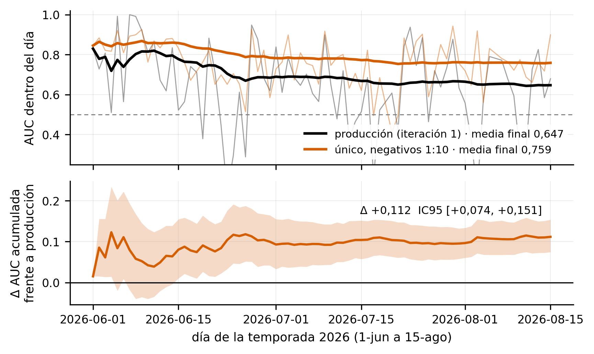
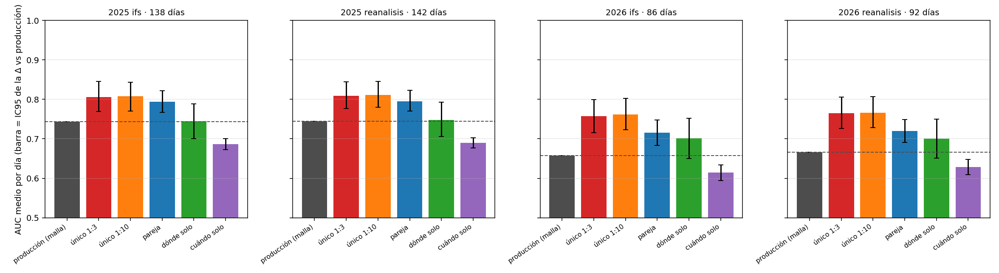
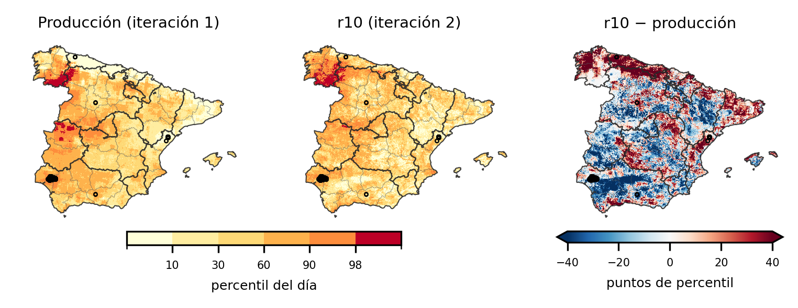

# 6 · Los dos sistemas sobre los mismos días

Para saber si el rediseño aportó algo se compararon los dos sistemas en
igualdad de condiciones: los mismos días, la misma meteorología y la misma
verdad. El 0.89 de test y el 0.64 de operación no se pueden comparar entre sí
porque no miden lo mismo.

La comparación tiene dos bloques. El primero puntúa los sistemas sobre la
temporada 2026 con reanálisis para todos, lo que da una cota superior. El
segundo, el replay, repite día a día las temporadas de 2025 y 2026 con la
previsión que había cada víspera. El resultado que se da en la memoria es el
del replay.

## Bloque 1. La temporada 2026 con reanálisis

Los scripts de este bloque puntúan los mapas de la temporada contra dos
verdades: los perímetros de EFFIS (*European Forest Fire Information System*)
y los partes del MITECO (Ministerio para la Transición Ecológica y el Reto
Demográfico). El sistema de producción interpola las estaciones de AEMET
(Agencia Estatal de Meteorología) por IDW (*inverse distance weighting*); la
malla es la geometría de los candidatos.

| Script | Qué hace | Para qué se usa |
|---|---|---|
| `dos_09_temporada2026.py` | Puntúa todos los modelos día a día sobre 2026 contra el área quemada de EFFIS, con las mismas variables para todos | La tabla de abajo |
| `dos_11_miteco.py` | Los mismos mapas, puntuados con los partes del MITECO | Segunda verdad |
| `dos_20_aciertos.py` | Cuántas celdas quemadas caen en el 2 % superior del mapa | Lectura operativa del ranking |
| `dos_21_hectareas.py` | Lo mismo ponderando por hectáreas y separando fuegos grandes de pequeños | Qué modelo acierta los grandes |
| `dos_22_ventana.py` | El mapa del día D contra el fuego de D a D+k | Si vale marcar la zona con antelación |
| `dos_23_vispera.py` | El mapa de la víspera contra el fuego de hoy, sin la meteorología del propio día | Evaluación a un día vista |
| `comparar_julio2026.py` | Julio de 2026, 17 días con superficie quemada: producción (AEMET e IDW) frente a la malla | Primera comparación entre sistemas |
| `comparar_produccion.py` | Malla frente a producción el mismo día, celda a celda | Comprobación diaria |
| `comparar_rankings.py` | La malla frente a los rankings por estación de producción | Comparación en la geometría de producción |
| `comparar_rankings_justo.py` | Previsión contra previsión, 19 días, sin reanálisis para nadie | Comparación sin ventaja para ninguno |
| `dos_19_veredicto.py` | La figura de la temporada: AUC por día y diferencia acumulada con IC95 | Seguimiento |

*AUC dentro del día de cada modelo y ventaja acumulada del r10 sobre producción, con su intervalo.*

La tabla siguiente recoge, para la temporada 2026, el AUC (*Area Under the
ROC Curve*) medio por día contra la superficie quemada de EFFIS:

| Sistema | Todos los días | Días grandes (11) | Sin FIRMS |
|---|---|---|---|
| producción (`xgb_v2`) | 0.647 | 0.692 | 0.611 |
| único (`donde_dia_effis`) | 0.752 | 0.746 | 0.744 |
| único 1:10 (r10) | 0.759 | 0.763 | — |
| pareja | 0.705 | 0.763 | — |

El r10 obtuvo 0.759 frente a 0.647 de producción, una diferencia Δ de +0.112
con IC95 (intervalo de confianza) [+0.074, +0.151], y ganó el 76 % de
los días. La diferencia es significativa para los tres candidatos.

FIRMS (*Fire Information for Resource Management System*) aporta poco:
producción baja de 0.647 a 0.611 sin esa variable, y en los once días de
megaincendio producción con y sin FIRMS no se distinguen. En la comparación
previsión contra previsión, 19 días sin reanálisis para nadie, el ranking de
producción obtuvo 0.568 y la malla con el modelo de producción 0.547. El único
obtuvo 0.605 y ganó 14 de 19 días. Fue la primera vez que el único superó a
producción en el ranking por estación, que es la geometría propia de
producción.

## Bloque 2. El replay de 2025 y 2026

El replay repite la comparación como se haría en operación: día a día, con la
pasada del IFS (*Integrated Forecasting System*) disponible la víspera,
archivada fuera del repo por tamaño, y puntuando contra los perímetros EFFIS
de ese día. Son dos temporadas y 250 días. El protocolo (modelos, métrica y
regla de decisión) se escribió en `docs/TRAZABILIDAD.md` el 02/09/2026 a las
18:10 (commit `ed7931f`), antes de ejecutar las temporadas.

| Script | Qué hace |
|---|---|
| `replay_verdad.py` | La verdad EFFIS por día (celda de 1 km, primer día de cada perímetro) para 2025 y 2026 |
| `replay_dia.py` | Un día: reanálisis truncado a D−7, IFS de archivo, FIRMS hasta D−1; puntúa los seis modelos. Unos 15 s |
| `replay_temporada.py` | El bucle de temporada, reanudable |
| `replay_veredicto.py` | AUC medio por día, diferencia contra producción, IC95 bootstrap, días que gana, captura en el 2 % superior. Escribe `docs/REPLAY_VEREDICTO.md` |
| `replay_si.py` | Primera versión del aviso de día con un umbral fijado en un solo verano (`docs/REPLAY_SI.md`); la calibración definitiva está en `56_calibracion` |
| `replay_precision.py` | Precisión exacta en la punta y lift (`docs/REPLAY_PRECISION.md`) |
| `replay_radio.py` | Tolerancia espacial de la verdad a 2, 4 y 6 km (`docs/REPLAY_RADIO.md`) |
| `replay_cobertura.py` | Cobertura de incendios con el top dilatado a R km (`docs/REPLAY_COBERTURA.md`) |
| `replay_figuras.py` | Las figuras del replay |
| `replay_dia_todo.py`, `replay_temporada_todo.py` | Variantes para el r10 entrenado con todos los años (`docs/R10_TODOS_LOS_ANIOS.md`) |
| `verificar_replay.py` | Comprobación de punta a punta: un día del replay contra el mapa que publicó la cadena ese día |
| `dos_33_anomalia_punta.py` | Sensibilidad de la captura de hectáreas de 2026 a un solo día (el 23 de julio) |
| `captura_lift.py` | Superficie quemada dentro del 0.5-20 % de celdas de mayor riesgo de cada día, lift de los seis modelos y de la escala absoluta (`docs/REPLAY_CAPTURA.md`) |

Las métricas de precisión, radio y cobertura se añadieron después de escribir
el protocolo, y así consta en sus documentos.

*AUC medio de cada modelo en 2025 y 2026, con IFS y con reanálisis, y el intervalo de la diferencia contra producción.*

*El segundo mayor día de la temporada (44,672 ha): producción, r10 y la resta entre ambos, con los perímetros EFFIS del día.*

La tabla siguiente da el AUC medio por día con la previsión de la víspera:

| Temporada | Días con fuego | producción | único | r10 | pareja | Δ r10 (IC95) | gana |
|---|---|---|---|---|---|---|---|
| 2025 | 138 | 0.743 | 0.806 | 0.807 | 0.794 | +0.064 [+0.027, +0.101] | 60 % |
| 2026 | 86 | 0.658 | 0.757 | 0.762 | 0.716 | +0.104 [+0.065, +0.144] | 67 % |

El coste de la previsión (AUC con IFS menos AUC con reanálisis) es de −0.003
para todos los modelos, con un intervalo que cruza el cero. El resultado no
depende de acertar la meteorología al detalle. En 2025, dilatando el 2 %
superior del r10 a 6 km se cubre el 44 % de los incendios vigilando el 10 %
del territorio. Las tablas completas, con los seis modelos y las cuatro
condiciones, están en `docs/REPLAY_VEREDICTO.md`.

Los mapas del replay usan la previsión de cada víspera, pero se generaron a
posteriori. No son los mapas que se publicaron cada día
(`docs/LIMITACIONES.md` §3).

## Ejecutar

`dos_09`, `dos_11` y los `comparar_*` leen los mapas de la temporada del disco
externo (`TFM_USB`). El replay necesita además el archivo de entradas (pasadas
IFS de 2025 y 2026, ERA5-Land de 2025, FIRMS y EFFIS de 2025), que no está en
el repo por tamaño y se indica con `TFM_ARCHIVO`. Nada de este capítulo
corre con `muestras/`.
