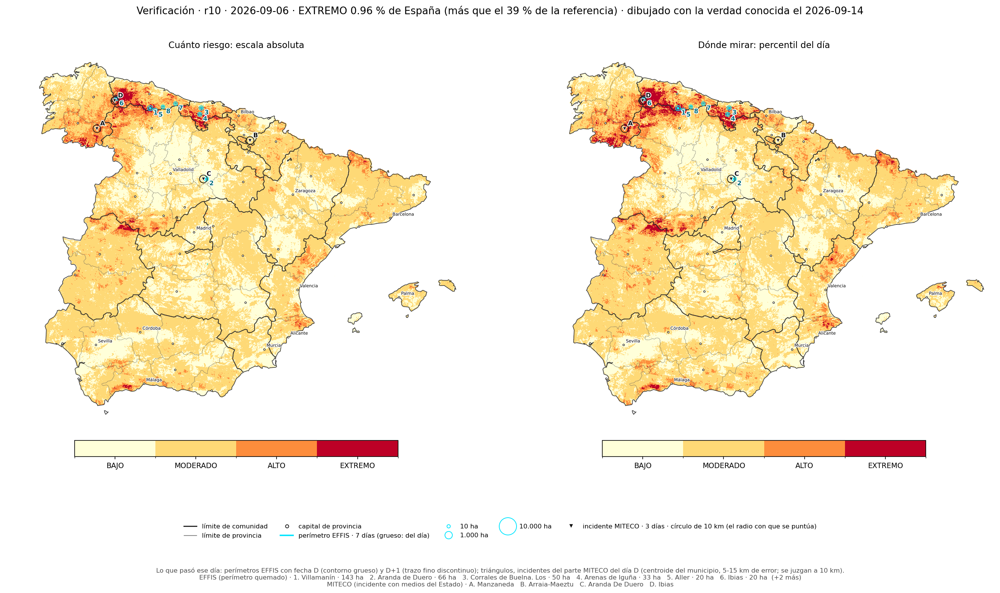

# 7 · Producción: el mapa de cada mañana

La cadena corre en GitHub Actions desde este repositorio
(`.github/workflows/mapa_diario.yml`), una vez al día, hacia las 03:03 en verano
y las 02:02 en invierno (hora de Madrid). Publica en `publicado/` el mapa de
hoy y el de mañana con el modelo elegido, el r10, de dos formas: en escala
absoluta, con la cifra del día, y por percentil del día. El estado que hace
falta entre corridas (el reanálisis acumulado y los mapas de los últimos días)
se guarda en el Release `estado` del repositorio, porque no cabe en git.

Durante la temporada de 2026 la misma cadena corrió en un repositorio aparte
(`tfm-fuego-malla`) y publicaba también los mapas de los otros candidatos. Aquí
queda su código completo, incluidos los scripts que ya no se ejecutan.


*El producto de la cadena: r10 en escala absoluta con la cifra del día, y el mismo modelo por percentil del día.*

## Cómo se genera un día

```
gh_estado.py pull          baja el estado de la corrida anterior (Release)
gh_reanalisis.py           ERA5-Land del mes en curso, incremental, hasta D-7 (CDS)
malla_02b_ifs.py           previsión IFS en los 5,605 nodos, de D-6 a D+1 (Open-Meteo)
riesgo_hoy.py              mapa de referencia: el modelo de producción sobre la malla
dos_riesgo_hoy.py          mapas de los candidatos; de aquí sale la puntuación del r10
mapas_hoy_manana.py        el producto: r10 en escala absoluta + cifra del día + percentil, PNG y JSON
verificar_mapas.py         la verdad (EFFIS, MITECO) sobre los mapas de los 20 últimos días
gh_estado.py push          guarda el estado; publicado/ se sube a git
```

La corrida completa tarda alrededor de una hora y cuarto. Casi todo el tiempo
es la espera de la descarga de ERA5-Land del CDS (*Climate Data Store* de
Copernicus) y de la previsión del IFS (*Integrated Forecasting System*) nodo a
nodo. La cadena necesita dos secretos en el repositorio: `CDSAPI_KEY`
(Copernicus) y `FIRMS_MAP_KEY` (NASA FIRMS, *Fire Information for Resource
Management System*, para los focos de la última semana).

## Los dos mapas y la cifra del día

La cadena calcula para cada celda una puntuación del r10 y la dibuja de dos
formas. Por percentil del día, el 2 % más alto se pinta en EXTREMO. Este mapa
indica dónde mirar, pero siempre hay un primero: un día de febrero sale con
tanto rojo como el 15 de agosto. En escala absoluta los cortes son fijos sobre
la puntuación (MODERADO ≥ 0.0060, ALTO ≥ 0.1125, EXTREMO ≥ 0.4058) y la
cantidad de rojo cambia con el riesgo del día. En el nivel EXTREMO ardió una
celda-día de cada 760, 13 veces la media.

Junto al mapa absoluto va la cifra del día: el porcentaje de España en EXTREMO
y su posición entre los 250 días de referencia.

## La verificación: lo que se predijo y lo que pasó

La verdad llega con retraso. El parte del MITECO (Ministerio para la Transición
Ecológica y el Reto Demográfico) del día D sale el D+1 hacia las 14 h. Los
perímetros de EFFIS (*European Forest Fire Information System*) tardan entre
seis y nueve días. Por eso cada corrida, después de los mapas del día, vuelve a
dibujar los de los veinte días anteriores con la verdad que ya se conoce
(`verificar_mapas.py`). El mapa original no se toca: por cada fecha hay
`mapas_<fecha>.png` (lo que se predijo) y `verificado_<fecha>.png` (lo mismo
con lo que ocurrió encima).



*El mapa del 6 de septiembre con los perímetros EFFIS de ese día (contorno) y los incidentes del parte MITECO (triángulos). Los incendios grandes del norte caen sobre EXTREMO.*

Sobre el mapa se dibujan dos verdades. Los perímetros EFFIS con fecha D van en
contorno grueso y los de fecha D+1 en trazo fino discontinuo. La fecha de EFFIS
es la de detección por satélite, y un fuego de la tarde aparece a menudo con
el día siguiente. Los incidentes del parte del MITECO del día D se
marcan con un triángulo en el centroide del municipio, que es lo único que da
el parte, con un error de 5 a 15 km. Por eso se juzgan con un radio de 10 km
alrededor: se toma el mejor nivel del mapa dentro de ese círculo. Es el mismo
criterio de `dos_15_veredicto_miteco.py` y el mismo parte que alimenta el
módulo de consulta del TFM. FIRMS no se dibuja porque es una variable de
entrada del modelo.

`publicado/verificacion.csv` guarda, por día, en qué nivel cayó cada verdad.
En los 13 primeros días de septiembre de 2026 el nivel EXTREMO ocupó entre el
0.2 y el 1.6 % de España. En esos días cayó en EXTREMO el 22 % de las celdas
quemadas del día y el 37 % de los incidentes MITECO (a 10 km). En ALTO o
EXTREMO cayeron el 66 % y el 78 %.

Los cortes y la referencia están en `escala_servicio.json` y se calibraron con
los mapas servidos del replay de 2025 y 2026. Los cortes del cubo
(`05_iteracion2/56_calibracion/dos_27_escala_absoluta.py`) no sirven para el
mapa servido: con ellos se marcaba entre 2 y 10 veces más EXTREMO que en el
cubo en el mismo mes. La referencia no tiene días de diciembre a abril y hay
que ampliarla con los días publicados.

La cadena aplicó hasta el 14/09/2026 un semáforo nacional que retiraba el
nivel EXTREMO los días de puntuación baja. Se evaluó y se descartó
(`escala_y_cifra/`): en verano ocultaba el EXTREMO en uno de cada tres días
con incendio grande.

## Qué hace cada script

| Script | Qué hace | Para qué se usa |
|---|---|---|
| `gh_reanalisis.py` | Descarga ERA5-Land del mes en curso de forma incremental y lo agrega a diario | Meteorología observada hasta D−7 |
| `riesgo_hoy.py` | Construye las 46 variables en los nodos (reanálisis, IFS, climatologías, FIRMS), puntúa el modelo de producción sobre las 498,530 celdas y dibuja el mapa | El mapa de referencia |
| `dos_riesgo_hoy.py` | Lo mismo con los modelos de etiqueta EFFIS: único, r10, pareja y dónde. Con `--pasada <fecha>` repite un día pasado | La puntuación del r10 de cada día |
| `mapas_hoy_manana.py` | Lee la puntuación del r10, aplica la escala absoluta y el percentil del día, calcula la cifra del día y escribe el PNG y el JSON que se publican | El producto final |
| `verificar_mapas.py` | Descarga los perímetros EFFIS de la temporada y el parte MITECO del día, regenera `miteco_incidentes.csv` y redibuja los mapas de los últimos días con esa verdad encima | `verificado_<fecha>.png` y `verificacion.csv` en `publicado/` |
| `escala_servicio.json` | Cortes de la escala absoluta y serie de referencia de la cifra del día | Lo lee `mapas_hoy_manana.py` |
| `gh_estado.py` | Baja y sube el estado de la cadena a un Release de GitHub | Persistencia entre corridas |
| `gh_exportar_estado.py` | Exporta desde el portátil lo que la cadena necesita del cubo y del disco externo (capas estáticas, climatologías, modelos) | Se ejecutó una vez, y cada vez que cambió un modelo |
| `gh_mensual_rapido.py` | Cachés mensuales de vegetación, LST (temperatura de superficie) e historial EGIF (Estadística General de Incendios Forestales) para los meses fuera de verano | Ampliar la cadena a todo el año |
| `capa_base.py` | Provincias, comunidades y ciudades sobre los mapas | Dibujo |
| `capa_verdad.py` | Perímetros EFFIS y focos FIRMS del día sobre los mapas | Dibujo |
| `redibujar.py` | Regenera un mapa ya publicado con el formato actual sin recalcular | Figuras |
| `dos_07_mapa_hoy.py` | Primer prototipo del mapa DÓNDE × CUÁNDO junto al de producción | Antecedente de `dos_riesgo_hoy.py` |
| `puntuar_effis.py`, `dos_15_veredicto_miteco.py`, `dos_16_juez_estaciones.py` | Puntuaban cada día los mapas de la temporada 2026 contra los perímetros EFFIS, los partes del MITECO y el ranking por estación de producción | Seguimiento durante el desarrollo. La evaluación de la memoria es el replay de `06_comparacion/`; estos scripts ya no forman parte de la cadena |

## Ejecutar con la muestra

Esta es la parte del repositorio que corre con `muestras/`, que es lo que hace
también GitHub Actions (allí tampoco está el cubo de 29 GB):

```bash
source entorno.sh
python 07_produccion/riesgo_hoy.py
python 07_produccion/dos_riesgo_hoy.py
python 07_produccion/mapas_hoy_manana.py
```

Para un día pasado del que se tenga la pasada IFS guardada,
`dos_riesgo_hoy.py --pasada 2026-08-20` y después
`mapas_hoy_manana.py --fecha 2026-08-20`.
