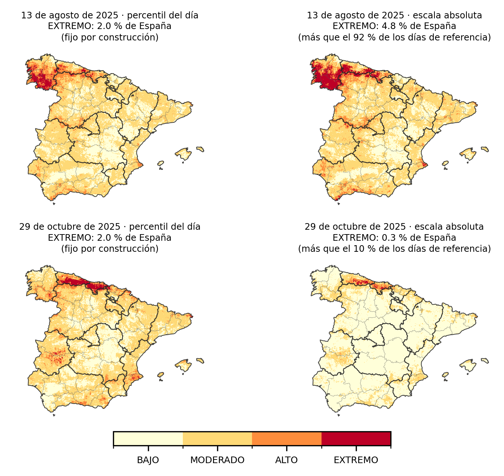
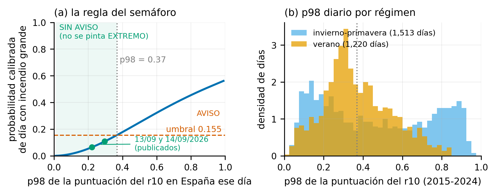
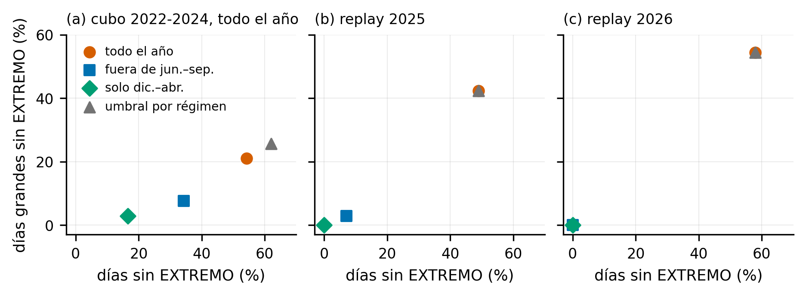

# Escala absoluta, cifra del día y semáforo descartado

Cómo se decide el color del mapa que publica la cadena diaria y qué significa.
Cada día se publican dos mapas del r10 (percentil del día y escala absoluta) y
una cifra: el porcentaje de España en nivel EXTREMO y su posición entre los
días de referencia.

*13 de agosto y 29 de octubre de 2025. Izquierda: percentil del día. Derecha: escala absoluta con la cifra del día.*

## Qué hay aquí

| Fichero | Qué hace | Salida |
|---|---|---|
| `calibrar_servicio.py` | Cortes de la escala absoluta y serie de referencia a partir de los mapas servidos del replay 2025-2026; significado de cada nivel; capacidad de la cifra del día | `calibracion_servicio.json`, `calibracion_servicio_dias.csv` y `../escala_servicio.json` |
| `comparar_cubo_servicio.py` | % de España en EXTREMO por mes con los cortes del cubo, en el cubo y en los mapas servidos | `comparar_cubo_servicio.txt` |
| `comparar_senales.py` | Capacidad de cuatro señales diarias (calendario, p98, % EXTREMO y % EXTREMO frente a su mes) para separar días con incendio grande, en el cubo 2022-2024 | `comparar_senales.txt` |
| `semaforo_variantes.py` | Cuatro variantes del semáforo nacional en el cubo y en el replay | `semaforo_variantes.csv` |
| `fig_benchmark_semaforo.py` | Figuras de captura y de variantes del semáforo | `docs/MEMORIA/figs/f13`, `f14` |
| `fig3_dos_mapas.py` | La figura de los dos mapas | `docs/MEMORIA/figs/f12_dos_mapas.png` |

Los scripts leen el replay (`archivo_ifs/replay/`) y las salidas de
`56_calibracion` con rutas absolutas del equipo donde se ejecutaron, como los
del replay (`docs/PROCEDENCIA.md`). Se ejecutaron el 14/09/2026 con el entorno
`tfm_fuego`.

## La escala absoluta se calibra sobre el servicio

Los cortes se calcularon primero con los diez años del cubo
(`05_iteracion2/56_calibracion/dos_27_escala_absoluta.py`). En los mapas que
produce la cadena marcaban muchas más celdas en EXTREMO que el cubo en el
mismo mes, con previsión y con reanálisis:

| Mes | Cubo 2015-2024 | Servicio 2025, previsión | Servicio 2025, reanálisis | Servicio 2026, previsión |
|---|---|---|---|---|
| Junio | 0.10 % | 0.37 % | 0.18 % | 0.65 % |
| Julio | 0.20 % | 1.02 % | 0.64 % | 1.34 % |
| Agosto | 0.57 % | 5.02 % | 4.64 % | 2.46 % |
| Septiembre | 0.30 % | 2.06 % | 2.40 % | — |
| Octubre | 0.31 % | 2.65 % | 3.06 % | — |

*Mediana diaria del % de España en EXTREMO con los cortes del cubo.*

La diferencia está en cómo se calculan las variables en servicio (nodos de
ERA5-Land, filtro de vecinos, climatologías de satélite; `docs/LIMITACIONES.md`
§8), no en la meteorología. Por eso los cortes publicados salen de los 250 días
servidos del replay (del 25 de mayo al 1 de noviembre de 2025 y del 25 de mayo
al 2 de septiembre de 2026):

| Nivel | Corte servicio | Corte cubo | Celdas-día | Una quemada de cada | Factor sobre la media | Hectáreas |
|---|---|---|---|---|---|---|
| BAJO | 0 | 0 | 30.0 % | 132,600 | 0.08 | 1.5 % |
| MODERADO | 0.0060 | 0.0018 | 60.0 % | 14,200 | 0.71 | 40.0 % |
| ALTO | 0.1125 | 0.0736 | 8.0 % | 2,760 | 3.63 | 29.5 % |
| EXTREMO | 0.4058 | 0.4066 | 2.0 % | 760 | 13.17 | 29.0 % |

El significado cambia entre temporadas. Con cortes calculados solo con 2025 y
medidos en 2026, en EXTREMO ardió una celda-día de cada 2,560 (factor 3.6); en
2025 había sido una de cada 550. En 2026 casi todo ardió en nivel ALTO (42.5 %
de las hectáreas). Hay que recalcular los cortes cuando haya más días servidos,
sobre todo de diciembre a abril, que ahora no están.

## La cifra del día

Es el porcentaje de España en EXTREMO ese día, situado entre los 250 días de
referencia (mediana 1.5 %, percentil 90 4.6 %, máximo 7.2 %).

Capacidad para separar días con incendio grande (al menos cinco celdas nuevas
quemadas), AUC:

| Datos | Periodo | Calendario | p98 | % EXTREMO | % EXTREMO frente a su mes |
|---|---|---|---|---|---|
| Cubo 2022-2024 | dic-abr | 0.607 | 0.892 | 0.873 | 0.830 |
| Cubo 2022-2024 | may, oct, nov | 0.570 | 0.804 | 0.792 | 0.720 |
| Cubo 2022-2024 | jun-sep | 0.707 | 0.773 | 0.773 | 0.734 |
| Servicio | 2025 | 0.738 | — | 0.689 | — |
| Servicio | 2026 | 0.437 | — | 0.663 | — |

El p98 y el % EXTREMO llevan casi la misma información. Comparar con el mismo
mes empeora, así que la referencia agrupa todos los días. En plena temporada la
cifra resume cuánto riesgo marca el mapa, pero no anticipa los días grandes
mejor que el calendario de forma consistente.

## El semáforo nacional, evaluado y descartado

Hasta el 14/09/2026 la cadena retiraba el nivel EXTREMO los días en que el p98
de la puntuación, pasado por una calibración beta (`dos_26_calibra_si.py`), no
llegaba a una probabilidad de día grande de 0.155.

Solo tuvo capacidad propia de diciembre a abril (BSS +0.297 en la prueba de
2024; en verano −0.107, con intervalo que cruza el cero). Variantes fuera de
calibración:

| Puerta | Cubo 2022-2024: días sin EXTREMO / días grandes perdidos | Replay 2026: días grandes perdidos / hectáreas |
|---|---|---|
| Todo el año | 54.3 % / 21.0 % | 54.4 % / 60.4 % |
| Fuera de junio-septiembre | 34.3 % / 7.6 % | 0 % / 0 % |
| Solo diciembre-abril | 16.5 % / 2.9 % | 0 % / 0 % |
| Umbral por época | 62.0 % / 25.7 % | 54.4 % / 60.4 % |

Se descartó. En verano, apagando el 60 % de los días se perdía el 34.6 % de los
días grandes con la señal del modelo y el 38.3 % eligiendo los días por
calendario: el interruptor no compensaba. Un aviso limitado a diciembre-abril
queda como línea futura, cuando haya mapas servidos de invierno para
calibrarlo.
