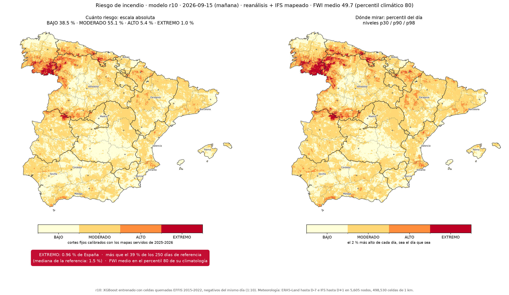

# Predicción diaria de riesgo de incendio forestal en España

Este repositorio contiene el módulo de aprendizaje automático de un Trabajo
Fin de Máster (TFM). Recoge la ingesta y el tratamiento de los datos, el
primer modelo y su puesta en producción, y el diagnóstico de por qué su acierto
de laboratorio no se trasladaba a la operación. Recoge también el rediseño, la
evaluación sobre dos temporadas completas y la cadena que publica cada mañana
el mapa del día.

## Los mapas de hoy y mañana




Se generan cada madrugada en GitHub Actions (`.github/workflows/mapa_diario.yml`,
hacia las 03:03 en verano y las 02:02 en invierno, hora de Madrid). Hay una
imagen para hoy y otra para mañana. En cada una, a la izquierda, está el modelo
elegido (r10) en escala absoluta, que indica cuánto riesgo hay. Lleva la cifra
del día: el porcentaje de España en nivel EXTREMO y su posición entre los días
de referencia. A la derecha está el mismo modelo por percentil del día, que
indica dónde mirar. Los veinte últimos días quedan en `publicado/`. De cada uno
hay también una versión verificada (`verificado_<fecha>.png`). Es el mismo mapa
con los perímetros de EFFIS y los incidentes del parte del MITECO de ese día
encima, dibujado días después, cuando esos datos ya están publicados
(`07_produccion/README.md`). EFFIS es el *European Forest Fire Information
System* y el MITECO, el Ministerio para la Transición Ecológica y el Reto
Demográfico.

## El resultado en un párrafo

El primer modelo alcanzó un AUC (*Area Under the ROC Curve*) de 0.89 en su
conjunto de test. Servido a diario y medido contra la superficie quemada real,
dio entre 0.57 y 0.64. Se descartaron el sobreajuste y el cambio de fuente
meteorológica como causas. La diferencia estaba en el muestreo y en la
etiqueta de entrenamiento, que definían la pregunta «¿es hoy un día peligroso
en esta celda?». En operación se le hacía otra: «¿cuál de las 498,530 celdas
arde hoy?». Con el conjunto de entrenamiento rediseñado para esa segunda
pregunta se entrenó un segundo modelo. Se reprodujeron día a día las temporadas
de 2025 y 2026 con la previsión disponible cada víspera (250 días, con el
protocolo escrito antes de ejecutar). El modelo único con etiqueta EFFIS y diez
negativos por positivo (r10) pasó de 0.743 a 0.807 en 2025 (Δ +0.064, IC95
[+0.027, +0.101]). En 2026 pasó de 0.658 a 0.762 (Δ +0.104, IC95 [+0.065,
+0.144]). IC es el intervalo de confianza. Supera al primer modelo en dos de
cada tres días. Usar la previsión a un día vista en lugar del reanálisis
no cambia el resultado (Δ −0.003, con un IC que cruza el cero).

## Cómo se lee el repositorio

Las carpetas siguen el orden de la memoria, que no coincide con el orden en que
se hizo el trabajo. Cada una tiene un `README.md` con lo que hace cada script y
para qué se usó.

| Carpeta | Qué contiene |
|---|---|
| `00_marco/` | El hilo de la memoria, el glosario y el diagrama de las dos iteraciones |
| `01_datos/` | Descarga y tratamiento de las nueve fuentes, común a las dos iteraciones |
| `02_eda/` | Análisis exploratorio del cubo y del conjunto de entrenamiento |
| `03_iteracion1/` | Etiqueta EGIF, muestreo caso-control, entrenamiento y puesta en producción |
| `04_bisagra/` | Por qué el 0.89 no medía lo que hacía falta |
| `05_iteracion2/` | Rediseño con etiqueta EFFIS, ablaciones y calibración en el cubo |
| `06_comparacion/` | Los dos sistemas sobre los mismos días, y el replay de 2025 y 2026 |
| `07_produccion/` | La cadena diaria: código, workflow y el producto final |
| `docs/` | [Trazabilidad número → script](docs/TRAZABILIDAD.md), [resultado del replay](docs/REPLAY_VEREDICTO.md), [procedencia de cada fichero](docs/PROCEDENCIA.md), [cómo está montado el repo](docs/ESTRUCTURA.md), [alcance y limitaciones](docs/LIMITACIONES.md), [bitácora](docs/BITACORA.md) y [la memoria](docs/MEMORIA/README.md) |
| `muestras/` | Recorte de julio de 2026 para ejecutar la rama de servicio sin descargar 44 GB |

Por dónde empezar: `00_marco/README.md` para el hilo, `04_bisagra/README.md`
para el diagnóstico, `docs/REPLAY_VEREDICTO.md` para el resultado final y
`docs/TRAZABILIDAD.md` para saber qué script produjo cada número. EGIF es la
Estadística General de Incendios Forestales, la etiqueta de la primera
iteración.

## Reproducibilidad

Los datos crudos (el cubo IberFire de 29 GB, el reanálisis, los históricos de
AEMET, la Agencia Estatal de Meteorología) no están en el repositorio; se
descargan con los scripts de `01_datos/`. Para trabajar sin esperar a las
descargas, `muestras/` lleva un recorte de julio de 2026 con el que la rama de
servicio corre en un portátil:

```bash
source entorno.sh                 # PYTHONPATH y rutas de datos
python 07_produccion/riesgo_hoy.py
python 07_produccion/dos_riesgo_hoy.py
python 07_produccion/mapas_hoy_manana.py
```

Los entrenamientos y las ablaciones necesitan el cubo y los datasets del disco
externo (`TFM_DATOS`, `TFM_USB`). `environment.yml` fija el entorno conda
(`tfm_fuego`, xgboost 3.2.0). Todos los modelos citados se reentrenaron en una
copia aislada y coinciden con los artefactos originales métrica a métrica y por
md5 del `.ubj` (`docs/TRAZABILIDAD.md`, apartado «Reproducción verificada»).

## Autoría

Trabajo Fin de Máster, 2026. Módulo de aprendizaje automático de un sistema de
apoyo a la gestión de incendios que tiene otros dos módulos: detección por
visión y consulta de partes. Datos: IberFire (CC-BY 4.0), EGIF vía Civio (CC
BY-SA 3.0), EFFIS y ERA5-Land (Copernicus), FIRMS (NASA), AEMET OpenData.
