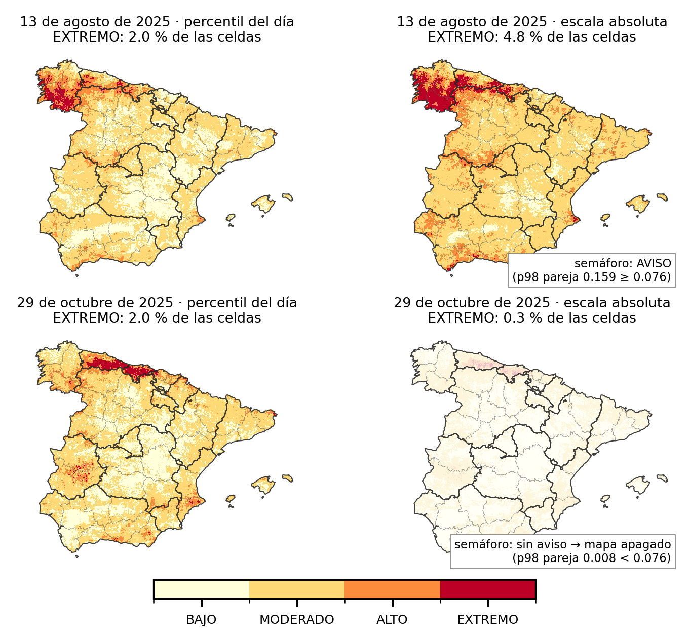

# Predicción diaria del riesgo de incendio: dónde y cuándo

## 1. Qué hace este módulo

La España peninsular cabe en 498.530 celdas de un kilómetro de lado. Este módulo
responde, cada mañana, a una sola pregunta: **cuáles de esas celdas van a arder
hoy**. No es un mapa de «zonas propensas», que sería el mismo todos los días,
sino una ordenación diaria de las celdas de más a menos peligro; lo único que
importa de ella es si las que efectivamente ardieron estaban arriba. Es el
«antes» del sistema conjunto: anticipa el riesgo que la visión por computador
confirma y que el asistente sobre los partes del MITECO permite consultar.

El trabajo se hizo dos veces, y esa es su parte más valiosa. Un primer modelo
dio 0,89 de acierto en el laboratorio y, puesto a funcionar cada día, 0,57-0,64.
La causa no era el algoritmo ni la meteorología: era que el conjunto de datos
con el que se entrenó hacía otra pregunta. Corregido eso, el segundo modelo pasa
de 0,74 a 0,81 en 2025 y de 0,66 a 0,76 en 2026 sobre las temporadas completas.

## 2. Los datos

Cuatro fuentes, descritas con detalle en el anexo A:

- **IberFire**, un «cubo» de datos abierto (Tekniker / UPV-EHU) con 261 variables
  diarias por celda de 1 km entre 2008 y 2024: tiempo, vegetación, terreno, usos
  del suelo, población, carreteras. De aquí salen casi todas las variables.
- **EGIF**, el registro oficial de incendios del Ministerio: una fila por
  incendio con su fecha y el **punto** de inicio. Etiqueta del primer modelo.
- **EFFIS**, los **perímetros** de superficie quemada que Copernicus cartografía
  por satélite. Etiqueta del segundo modelo y verdad contra la que se juzgan
  los dos.
- **ERA5-Land e IFS** (ECMWF), el reanálisis meteorológico —lo que pasó— y la
  previsión —lo que va a pasar—. Se entrena con lo que pasó y se sirve cada día
  con lo que va a pasar; en el primer modelo, con la observación de 687
  estaciones de AEMET.

De ahí se construyen **46 variables** por celda y día, en cuatro familias: *qué
tiempo hace* (temperatura, humedad, viento, lluvia de hoy y de los últimos 7, 15
y 30 días, índice de peligro FWI), *qué hay en la celda* (bosque, matorral,
pendiente, altitud, carreteras, población), *qué ha ardido cerca antes*
(incendios a 1 y 10 km en meses y años anteriores, focos térmicos de satélite en
la última semana) y *qué día es*.

**Lo que enseñó el análisis exploratorio.** Tres cosas que condicionan todo lo
demás. El fuego es rarísimo: en un verano normal arden entre 2 y 6 celdas de
cada 100.000 cada día, y solo el 3 % de las celdas ha tenido alguna ignición en
seis años. El fuego se agrupa: las celdas quemadas son contiguas —perímetros, no
puntos—, así que partir los datos al azar entre entrenamiento y prueba infla el
acierto (+0,036 medido); todas las particiones del trabajo son por bloques de
100 km o por años. Y **el FWI hay que leerlo en local**: un FWI de 40 es rutina
en Almería y excepcional en Asturias, y lo que separa los días con fuego no es
el número sino lo raro que es *ahí*. El percentil del FWI respecto a la
historia de la propia celda separa mejor que el valor absoluto (mediana 84 en
positivos frente a 47 en negativos) y aporta +0,042 de acierto. Es una
aportación propia del trabajo y la conservan los dos modelos.

## 3. Primer modelo: entrenamiento y evaluación

El primer modelo se construyó como se construyen casi todos los de la
literatura. Los positivos son los 19.561 incendios del registro EGIF de 2015 a
2020, cada uno en su celda y su fecha. Los negativos se sortean tomando **la
misma celda en otros días** en que no ardió, tres por cada positivo. Se entrena
un XGBoost, se afina con 2021 y se prueba con 2022, el peor año de la década,
con Losacio y Sierra de la Culebra dentro. Resultado: **AUC 0,89**, sin fugas
(con las etiquetas barajadas cae al azar) y sin colapso al validarlo por
bloques espaciales de 100 km. Afinar los parámetros añadía +0,007: el rendimiento estaba en las
variables, no en el ajuste.

Con ese resultado se puso en producción en julio de 2026: cada mañana descarga
la observación de las 687 estaciones, calcula las 46 variables y publica un
ranking nacional y un mapa de riesgo para hoy y mañana. Desde entonces corre a diario, y esa serie sellada es lo que permite lo que sigue.

Y entonces se midió contra la realidad: contra los perímetros de EFFIS, contra
los partes diarios del MITECO y contra los focos térmicos de satélite. El
acierto diario del modelo en producción estuvo entre **0,57 y 0,64**. Un índice
sin modelo, el percentil local del FWI a secas, sacaba 0,70.

Había tres sospechosos, y los dos primeros se descartaron con números:

1. **¿Está mal medido?** No: tres verdades independientes —satélite, cartografía
   y partes oficiales— cuentan lo mismo.
2. **¿Es la meteorología?** El modelo se entrenó con el reanálisis del cubo y se
   sirve con estaciones. Hay diferencias reales —el reanálisis «llueve» 8 mm más
   al mes y eso baja el FWI 10 puntos—, pero cuantificadas no explican la caída.
   Tampoco lo que cambia entre entrenar y servir: sustituir las variables de
   satélite por su climatología cuesta 0,0045.
3. **Es la pregunta.** Al sortear los negativos en *la misma celda otros días*,
   el 98,8 % de las celdas de la muestra tenían exactamente un
   25 % de días con fuego. El modelo no podía aprender qué celda es más
   peligrosa que otra, porque todas tenían la misma proporción; solo podía
   aprender **qué día** es peligroso. Respondía a «¿es hoy un día malo en esta
   celda?» y en operación se le preguntaba «¿cuál de las 498.530 celdas arde
   hoy?».

## 4. Segundo modelo: cambiar la pregunta, no el algoritmo

La figura 1 resume el problema y la solución. En el primer diseño (a) cada
celda quemada se compara consigo misma en otros días; en el segundo (b) se
compara con otras celdas del mismo día, que es exactamente lo que se pide en
operación (c). La prueba de que esto es lo que fallaba es que la métrica de
laboratorio era ciega a la diferencia: dos conjuntos de entrenamiento, uno con
cada diseño, dan **0,92 los dos** medidos cada uno con su propio banco de
pruebas; medidos **dentro de cada día**, como se usan, dan 0,744 y 0,828.

**Figura 1.** La misma rejilla celda × día con los dos diseños de muestreo y la pregunta operativa. (a) Iteración 1: para cada celda quemada, los negativos son *la misma celda en otros días*; el modelo solo puede aprender qué día es peligroso. (b) Iteración 2: los negativos son *otras celdas del mismo día*; el modelo aprende a comparar celdas. (c) Lo que se pide cada mañana: ordenar todas las celdas de hoy. Solo (b) hace la misma pregunta que (c).

La segunda versión cambia exactamente dos cosas y deja lo demás igual: las
mismas 46 variables, el mismo algoritmo con los mismos parámetros, la misma
malla. **Los negativos son otras celdas del mismo día**, y **la etiqueta es la
superficie quemada de EFFIS**, la misma con la que se juzga —entrenar con puntos
de ignición y evaluar con perímetros era comparar dos cosas distintas: solo el
15 % de las igniciones de 25-100 ha coincide celda a celda con un perímetro
del mismo día—. Se entrena con 2015-2022, se afina con 2023 y se prueba con
2024, siempre dentro de cada día. Se compararon un modelo único frente a la
pareja de un *dónde* (fijo) por un *cuándo* (diario), y distintas cantidades de
negativos por positivo. Se eligió el **modelo único
con diez negativos por positivo**, «r10» en adelante: la cantidad de negativos
mueve el acierto medio apenas +0,01, del orden del azar del sorteo, y en la temporada de 2026 el
1:10 fue el que mejor situó los incendios grandes, que es donde importa. Las pruebas
que salieron mal —entrenar solo con verano empeora, añadir una capa de «ya
quemado» empeora— están en el anexo B.

Antes de dar por bueno un modelo conviene mirar en qué se fija, y que cuadre
con lo que se sabe del fuego (figura 2). Lo que más pesa es el **historial**:
cuántos incendios ha habido a 10 km en ese mismo mes en años anteriores.
Después el **combustible** —verdor acumulado en el último mes, matorral,
pendiente— y el **tiempo**: humedad mínima baja y FWI anómalo para la celda
empujan hacia arriba; suelo agrícola y lluvia reciente, hacia abajo. Es el
retrato que daría un técnico de extinción, con un matiz: el verdor y la temperatura de superficie *del propio día* llevan ya
parte de la firma del incendio en el cubo (pesan un 4 % del modelo) y en
servicio se sustituyen por su climatología mensual.

**Figura 2.** Qué mira el r10: las 15 variables de mayor peso por valores SHAP sobre 6.000 celdas-día de los veranos de 2023 y 2024, que el modelo no vio al entrenar. Izquierda, importancia media; derecha, el efecto de cada fila (a la derecha del cero, empuja el riesgo hacia arriba) con el valor de la variable en color (rojo, alto). Historial de fuego, combustible y sequedad, por ese orden.

## 5. Resultados, límites y conclusiones

Para comparar con justicia hay que poner a los dos modelos ante los mismos días,
la misma meteorología y la misma verdad. Se reprodujeron día a día las temporadas
de 2025 (1 de junio a 1 de noviembre) y 2026 (hasta el 2 de septiembre),
alimentando a ambos con **la previsión disponible la víspera** y juzgándolos con
los perímetros de EFFIS. El protocolo se escribió antes de ejecutar nada.

**Tabla 1.** Acierto medio por día (AUC dentro del día) de producción y del r10 con la previsión de la víspera, juzgados con EFFIS. La diferencia es la media pareada día a día, con intervalo bootstrap al 95 %.

| Temporada | Días con fuego | Hectáreas | Producción | r10 | Diferencia (IC 95 %) | Días que gana el r10 |
|---|---|---|---|---|---|---|
| 2025 | 138 | 387.000 | 0,743 | **0,807** | +0,064 [+0,027, +0,101] | 60 % |
| 2026 | 86 | 268.000 | 0,658 | **0,762** | +0,104 [+0,065, +0,144] | 67 % |

Tres lecturas. **La mejora no es ruido**: el intervalo no toca el cero en
ninguna temporada y el r10 gana dos de cada tres días, más en 2026, cuando
producción lo pasó peor. **Predecir no cuesta nada**: cada día se calculó con la
previsión de la víspera y con el tiempo que realmente hizo, y la diferencia es
−0,003; el modelo no depende de acertar el tiempo al detalle sino de saber dónde
está el combustible y cuánto lleva seco. **Es un mapa para vigilar, no una
alarma por celda**: que arda una celda concreta un día concreto es una de cada
diez mil, y el mapa dice dónde mirar, no dónde va a arder. El sistema corre
además en vivo desde el 21 de agosto contra tres jueces diarios; el r10 va por
delante, pero con pocos días los intervalos aún cruzan el cero (anexo C).

**Del ranking al producto.** El mapa se pintaba por posición en el ranking del
día —el 2 % más alto en rojo—, y el ranking siempre tiene un primero: un
martes de febrero sale con tanto rojo como el 15 de agosto. La solución tiene
dos piezas (figura 3). La primera es fijar los colores
**en la escala de la nota**: se pasaron los modelos por los diez años del cubo y
se anotó a partir de qué nota se entra en el 2 % más alto *de toda la
historia*; con esa regla, de cada 800 celdas pintadas de EXTREMO en diez años
ardió una, 36 veces el promedio. La segunda es un **semáforo nacional**: si la
nota del 2 % más alto de España ese día no supera el umbral que en la historia separa
los días con incendio grande, hoy no es día de fuego y el mapa no se pinta. Con
esa puerta, en invierno el 44 % de los días quedan sin rojo perdiendo el 6 % de
los días grandes. El semáforo tiene habilidad fuera de temporada y ninguna en
verano, cuando casi todos los días pasan del umbral: en verano manda el mapa, en
invierno el semáforo evita el rojo falso. La nota **no es una probabilidad**:
es una puntuación para ordenar y comparar con umbrales, y así se presenta.

**Figura 3.** El mismo modelo (r10) pintado de dos maneras en un día de pleno verano (13 de agosto de 2025, arriba) y en uno fuera de temporada (29 de octubre de 2025, abajo). Izquierda: niveles por percentil del día, que reparten el 2 % de EXTREMO cada día sin excepción. Derecha: cortes fijos en la escala de la nota, aprendidos de diez años de historia, y el semáforo nacional: el 29 de octubre no supera el umbral y el mapa se apaga.

**Límites.** La evaluación de dos temporadas es a posteriori: los mapas usan
la previsión de cada víspera, pero se generaron después, no sellados día a
día; lo sellado es la cadena en vivo, que aún tiene pocos días. La producción sirve una versión con un defecto conocido en el
cálculo del viento, no corregido a propósito para no romper la comparación
(anexo E). Cobertura: Península y Baleares, sin Canarias; datos de 2026 hasta
el 2 de septiembre.

**Conclusión.** Un modelo se optimiza para la pregunta que define su conjunto
de entrenamiento, y esa pregunta la fija la elección de positivos y negativos,
no la intención de quien lo entrena. Un acierto alto sobre un banco construido
con el mismo diseño que el entrenamiento no demuestra nada sobre el uso
previsto. La comprobación que lo detecta —evaluar dentro de cada día, con la
misma verdad con la que se va a juzgar el sistema— es barata y debería hacerse
antes de entrenar, no después de dos meses en producción. El código, con cada
cifra enlazada a su script, está en el repositorio (anexo F).

---
---

## Notas para el autor (no van a la memoria)

> Sección de *machine learning* de la memoria conjunta. Objetivo: 4 caras (5 como
> máximo), tono divulgativo, sin fundamentos ni código. Versión del 09/09/2026,
> reestructurada en cuatro bloques de una cara: introducción + datos + EDA ·
> primer modelo y su evaluación · el segundo modelo y su evaluación · resultados,
> límites y conclusiones. Cifras trazadas en «Notas para el autor» (no van a la
> memoria) y en `docs/TRAZABILIDAD.md`.

**Presupuesto.** ~1.900 palabras + 1 tabla + 3 figuras a 10 pt ≈ 4-4,5 caras.
Si hay que llegar a 4 justas: quitar el párrafo «Del ranking al producto» y la
figura 3, o recortar el §2 (EDA). El §5 (tabla 1 y sus tres lecturas) no se toca.

**Qué cambió el 09/09 respecto al borrador del 07/09:** estructura en cuatro
caras (intro+datos+EDA · modelo 1 · modelo 2 · resultados); nuevo bloque de
EDA (prevalencia, agrupación, percentil local); figura 1 rehecha en rejilla
4×4; fuera la figura del 7-ago-2026 (f9) y el párrafo de cobertura (lift ×12,
44 %/10 % vs 29 %/6,6 %), que `HALLAZGOS_COBERTURA.md` señala como comparación
a territorio desigual; fuera la tabla de fuentes (pasa a lista); el lift ×36
se deja solo, sin el ×12, para no mezclar el lift del día con el de la década.

**Trazabilidad de cada cifra** (ver `docs/TRAZABILIDAD.md`):

| Cifra | Origen |
|---|---|
| 498.530 celdas, 261 variables, 2008-2024 | `02_eda/ANALISIS_CUBO.md` |
| 2-6 por 100.000; 2,97 %; +0,036 partición al azar | `02_eda/README.md` (dos_00, dos_04) |
| Mediana pctl 84 vs 47; +0,042 | `02_eda/figuras/eda_resumen.log`; `35_ablaciones/ablacion_features.py` |
| 19.561 EGIF 2015-20; 0,89 (0,8906 test 2022); 0,848 bloques; +0,007 Optuna; barajado 0,231 | `03_iteracion1/README.md` |
| 687 estaciones; 0,57-0,64; FWI percentil 0,70 | `04_bisagra/41_*` |
| +8 mm/30 d; −0,0045 | `42_no_es_la_meteo/experimento_b_era5.py`; `43_*` |
| 98,8 %; 0,92 / 0,744 vs 0,828; 15 % EGIF-EFFIS | `44_*`, `dos_04_analisis.py` |
| Split 2015-22 / 2023 / 2024; ratio +0,006…+0,017, ruido 0,004-0,005 | `dos_13_modelos_effis.py`, `dos_18_ratio.py` |
| Tabla 1 (replay) | `docs/REPLAY_VEREDICTO.md` (2025_ifs, 2026_ifs) |
| Coste previsión −0,003 | `REPLAY_VEREDICTO.md`, bloques ifs_menos_reanalisis |
| Una de cada diez mil | prevalencia media diaria de verano (`REPLAY_PRECISION.md`) |
| Jueces en vivo | `publicado/historico_veredictos.csv` (última corrida 34327113443, 09/09) |
| 1 de cada 800 (lift 35,6×); 44 % / 6,2 %; sin habilidad en verano | `05_iteracion2/56_calibracion/README.md`; `calibracion_si/RESULTADOS_05SEP.md` |
| Bug del viento | `LIMITACIONES.md` §1 |

**Figuras:** f2 (`figs/scripts/f2_disenios.py`, rejilla 4×4), f11
(`f11_shap_r10.py`, lee el USB `TFM_USB`), f10 (`f10_percentil_vs_absoluto.py`,
r10 del replay 2025-08-13 y 2025-10-29, lee `archivo_ifs/replay/`). El PDF se
genera con `figs/scripts/hacer_pdf.py` (markdown + weasyprint).

**Anexos referenciados:** A fuentes y variables · B ablaciones y resultados
negativos · C jueces en vivo al cierre · E incidentes (fuga FIRMS, días perdidos
27-31/08, mapa del 21-ago, bug del viento) · F guía del repositorio. El anexo D
(calibración del semáforo) ya no se cita en el texto; citarlo en el párrafo
«Del ranking al producto» si se mantiene.
