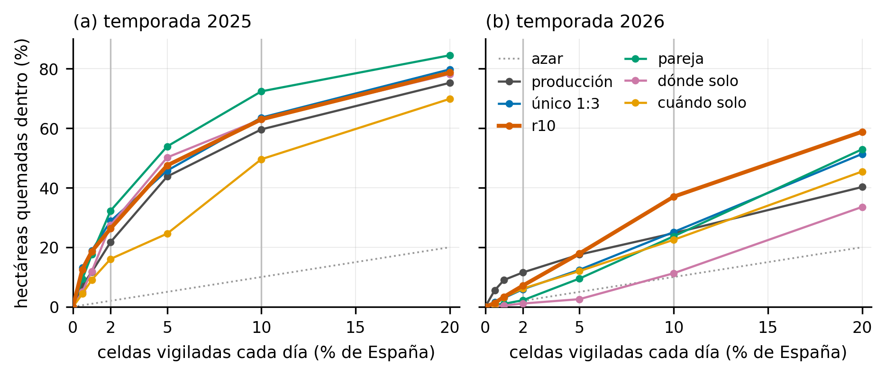

# Territorio vigilado y superficie quemada en el replay

Qué parte de la superficie quemada de cada temporada cayó en las celdas de mayor
riesgo de cada día, según el porcentaje de España vigilado. Replay de 2025 y
2026 con la previsión de la víspera (138 y 86 días con fuego). Script:
`06_comparacion/captura_lift.py`; resultados en `docs/resultados/`.

- **Ha (%)**: hectáreas quemadas dentro de la zona vigilada / hectáreas de la temporada.
- **Lift**: Ha (%) / % del territorio vigilado. Un lift de 1 es señalar celdas al azar.
- **Inc. ≥100 ha**: incendios de al menos 100 ha con alguna celda dentro.

Estas hectáreas no son superficie evitada: miden cuánto fuego cayó dentro de la
zona señalada.

## Temporada 2025

| Modelo | 2 %: ha / lift | 5 %: ha / lift | 10 %: ha / lift | 20 %: ha / lift | Inc. ≥100 ha en el 10 % |
|---|---|---|---|---|---|
| producción | 21.7 % / 10.9 | 43.8 % / 8.8 | 59.6 % / 6.0 | 75.3 % / 3.8 | 66.9 % |
| único 1:3 | 28.8 % / 14.4 | 45.8 % / 9.2 | 63.6 % / 6.4 | 79.8 % / 4.0 | 67.6 % |
| r10 | 26.3 % / 13.2 | 47.5 % / 9.5 | 63.0 % / 6.3 | 78.7 % / 3.9 | 69.6 % |
| pareja | 32.3 % / 16.1 | 53.9 % / 10.8 | 72.4 % / 7.2 | 84.5 % / 4.2 | 73.0 % |
| dónde solo | 27.5 % / 13.7 | 50.2 % / 10.0 | 63.0 % / 6.3 | 78.2 % / 3.9 | 56.1 % |
| cuándo solo | 16.1 % / 8.0 | 24.6 % / 4.9 | 49.6 % / 5.0 | 69.9 % / 3.5 | 56.8 % |

## Temporada 2026

| Modelo | 2 %: ha / lift | 5 %: ha / lift | 10 %: ha / lift | 20 %: ha / lift | Inc. ≥100 ha en el 10 % |
|---|---|---|---|---|---|
| producción | 11.5 % / 5.8 | 17.5 % / 3.5 | 24.7 % / 2.5 | 40.2 % / 2.0 | 40.6 % |
| único 1:3 | 5.9 % / 3.0 | 12.4 % / 2.5 | 25.1 % / 2.5 | 51.4 % / 2.6 | 59.4 % |
| r10 | 7.1 % / 3.6 | 17.9 % / 3.6 | 37.0 % / 3.7 | 58.8 % / 2.9 | 62.3 % |
| pareja | 2.2 % / 1.1 | 9.5 % / 1.9 | 23.7 % / 2.4 | 52.9 % / 2.6 | 58.5 % |
| dónde solo | 1.1 % / 0.5 | 2.6 % / 0.5 | 11.3 % / 1.1 | 33.6 % / 1.7 | 39.6 % |
| cuándo solo | 6.1 % / 3.1 | 12.0 % / 2.4 | 22.5 % / 2.3 | 45.5 % / 2.3 | 31.1 % |

## Escala absoluta del r10

Con los cortes del servicio (`07_produccion/escala_servicio.json`), sobre las celdas-día de cada temporada.

| Zona | 2025: celdas-día / ha / lift | 2026: celdas-día / ha / lift |
|---|---|---|
| 2 % por percentil del día | 2.0 % / 26.3 % / 13.2 | 2.0 % / 7.1 % / 3.6 |
| EXTREMO | 2.3 % / 46.4 % / 19.9 | 1.5 % / 3.8 % / 2.6 |
| ALTO y EXTREMO | 9.4 % / 69.5 % / 7.4 | 11.0 % / 42.6 % / 3.9 |

